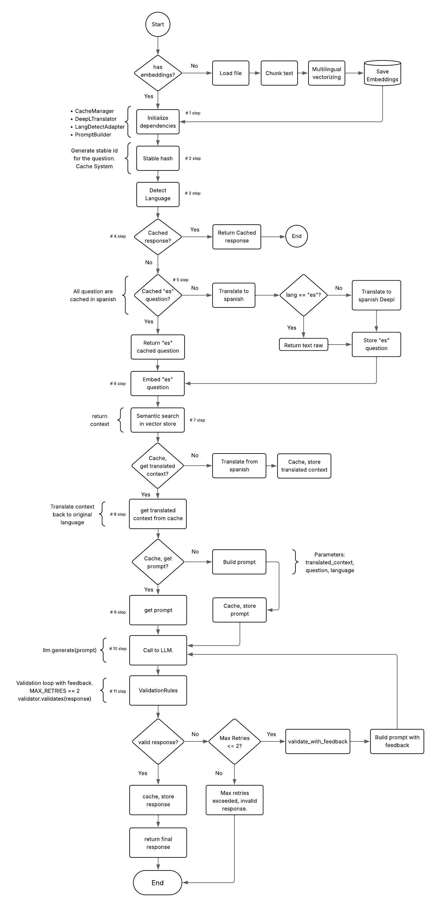

# 🔍 POC Multilingual RAG Pipeline — SOLID, Cached, and Production-Ready

## 📐 Diagram



## 🌍 Overview (English)

This project is a fully modular, production-grade **RAG (Retrieval-Augmented Generation)** system, designed with multilingual capabilities in **Spanish**, **English**, and **Portuguese**. It leverages powerful APIs like **Cohere** and **DeepL** and is implemented following **SOLID principles** and best practices for clean, maintainable, and testable code.

### 🚀 Features

- ✅ Multilingual support (ES, EN, PT)
- ✅ Cohere embeddings and language model
- ✅ DeepL-based language detection and translation
- ✅ JSON-based persistent caching system
- ✅ Custom prompt builder with context awareness and validation rules
- ✅ Fully modular design using Protocols, Interfaces, and Adapters
- ✅ FastAPI web interface
- ✅ Async-ready RAG pipeline
- ✅ Modular and integration tests with Pytest

### 🧠 What is RAG?

RAG combines the power of **retrieval systems** (like vector databases) with **generative language models**. Instead of generating responses based on a static knowledge base, this pipeline retrieves relevant information dynamically and uses that context to generate accurate, up-to-date answers.

### 🧱 Technologies Used

- Python 3.11+
- FastAPI
- Cohere API ([Sign up here](https://dashboard.cohere.com/api-keys))
- DeepL API ([Sign up here](https://www.deepl.com/pro))
- ChromaDB for vector storage
- Pytest for testing
- Pydantic for request/response validation

### 💡 SOLID Principles

This project adheres strictly to the **SOLID principles** of software engineering:

- **S**ingle Responsibility
- **O**pen/Closed Principle
- **L**iskov Substitution
- **I**nterface Segregation
- **D**ependency Inversion

All components are modular, extensible, and easily testable.

### 🧰 How to Run the Project

1. **Install dependencies**:

    ```bash
    pip install -r requirements.txt
    ```

2. **Set up your environment variables**:

    Create a `.env` file from the example provided:

    ```bash
    cp .env.example .env
    ```

    Then, add your API keys:

    - `COHERE_API_KEY`: Get it [here](https://dashboard.cohere.com/api-keys)
    - `DEEPL_API_KEY`: Get it [here](https://www.deepl.com/pro)

3. **Start the server**:

    ```bash
    uvicorn app.app:app --reload
    ```

4. **Run the tests**:

    ```bash
    pytest -s tests/test_rag_responses.py
    ```

### 🐳 Running with Docker (optional)

You can also run the entire project using **Docker Compose**, including both the FastAPI service and ChromaDB vector store.

#### 🔧 Instructions:

1. Make sure you have your `.env` file with valid API keys:

    ```bash
    cp .env.example .env
    ```

2. Then simply run:

    ```bash
    docker-compose up --build
    ```

3. Visit your API at:

    ```
    http://localhost:8000/
    ```

4. To stop:

    ```bash
    docker-compose down
    ```

#### 📦 Services launched:

- `rag-api`: multilingual FastAPI RAG API
- `chroma`: vector database with persistent volume


### 🧠 Core Components

- **Cache System**: Uses JSON files to persist translated questions, contexts, and prompts.
- **Translation Pipeline**: Automatically detects and translates input into the embedding language.
- **Validation Rules**: Enforce response structure (e.g., emojis, one sentence, language).
- **Prompt Generation**: Dynamic prompt building with language-aware formatting.
- **Test Suite**: Ensures deterministic responses and verifies language integrity.

---

## 🌍 Descripción General (Español)

Este proyecto es un sistema **RAG (Generación Aumentada por Recuperación)** completamente modular y preparado para producción, con soporte multilingüe en **español**, **inglés** y **portugués**. Está diseñado con principios **SOLID** y buenas prácticas de programación y documentación.

### 🚀 Características

- ✅ Soporte multilingüe (ES, EN, PT)
- ✅ Embeddings y modelo de lenguaje de Cohere
- ✅ Detección de idioma y traducción con DeepL
- ✅ Sistema de cacheo persistente basado en JSON
- ✅ Generador de prompts inteligente y reglas de validación
- ✅ Arquitectura modular con Interfaces y Protocolos
- ✅ API construida con FastAPI
- ✅ Pipeline asincrónico RAG
- ✅ Tests modulares y de integración con Pytest

### 🧠 ¿Qué es RAG?

RAG combina sistemas de **recuperación de información** (vector stores) con modelos de lenguaje generativos. En lugar de responder desde una base fija, recupera contexto relevante en tiempo real y genera respuestas precisas y actualizadas.

### 🧱 Tecnologías utilizadas

- Python 3.11+
- FastAPI
- API de Cohere ([Crear cuenta](https://dashboard.cohere.com/api-keys))
- API de DeepL ([Crear cuenta](https://www.deepl.com/pro))
- ChromaDB como base de vectores
- Pytest para pruebas
- Pydantic para validación

### 💡 Principios SOLID

El diseño respeta los **principios SOLID**:

- **S**ingle Responsibility (Responsabilidad única)
- **O**pen/Closed (Abierto/Cerrado)
- **L**iskov Substitution (Sustitución de Liskov)
- **I**nterface Segregation (Segregación de Interfaces)
- **D**ependency Inversion (Inversión de Dependencias)

Cada componente es extensible, aislado y fácilmente testeable.

### 🧰 Cómo iniciar el proyecto

1. **Instalar dependencias**:

    ```bash
    pip install -r requirements.txt
    ```

2. **Configurar variables de entorno**:

    Crear el archivo `.env` desde el ejemplo:

    ```bash
    cp .env.example .env
    ```

    Luego, agregar tus claves:

    - `COHERE_API_KEY`: [Obtener aquí](https://dashboard.cohere.com/api-keys)
    - `DEEPL_API_KEY`: [Obtener aquí](https://www.deepl.com/pro)

3. **Iniciar el servidor**:

    ```bash
    uvicorn app.app:app --reload
    ```

4. **Ejecutar los tests**:

    ```bash
    pytest -s tests/test_rag_responses.py
    ```

### 🐳 Ejecutar con Docker (opcional)

También podés correr todo el proyecto con **Docker Compose**, incluyendo tanto el servicio FastAPI como ChromaDB como base vectorial.

#### 🔧 Instrucciones:

1. Asegurate de tener tu archivo `.env` con las claves API:

    ```bash
    cp .env.example .env
    ```

2. Luego ejecutá:

    ```bash
    docker-compose up --build
    ```

3. Accedé a la API en:

    ```
    http://localhost:8000/
    ```

4. Para detener los servicios:

    ```bash
    docker-compose down
    ```

#### 📦 Servicios que se levantan:

- `rag-api`: tu API RAG multilingüe con FastAPI
- `chroma`: base vectorial con volumen persistente


### 🧠 Componentes clave

- **Sistema de Caché**: Guarda en JSON traducciones, contextos y prompts generados.
- **Pipeline de Traducción**: Detecta y traduce entradas al idioma base de embeddings.
- **Reglas de Validación**: Verifican formato, uso de emojis, estructura y consistencia de idioma.
- **Generación de Prompts**: Construcción dinámica según idioma y contexto.
- **Suite de Tests**: Asegura consistencia y validez de respuestas.
